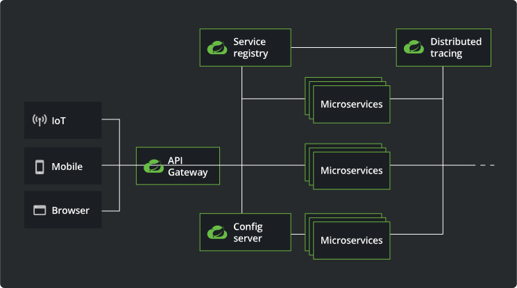

# 유레카 Gateway 샘플 ( Eureka Gateway )

## Spring Cloud 아키텍처 관계도

출처 : https://spring.io/cloud

## 개발환경
- JDK : Zulu JDK 17.0.10
- SpringBoot : 3.2.3
  - `org.springframework.boot:spring-boot-starter-web`
  - `org.springframework.cloud:spring-cloud-starter-netflix-eureka-client`
- SpringBoot Eureka Client : 현재 최신버전 4.1.0
- build tools : Gradle

## Spring Cloud 버전과 Spring Boot 버전 및 JDK 의 버전 호환성
- 출처
```text
https://spring.io/projects/spring-cloud#overview  
https://github.com/spring-projects/spring-framework/wiki/Spring-Framework-Versions
```
| Release Train        | Spring Boot Generation                | JDK 버전 ( LTS ) | 비고   |
|----------------------|---------------------------------------|----------------|------|
| 2023.0.x aka Leyton  | 3.2.x                                 | JDK 17         |      |
| 2022.0.x aka Kilburn | 3.0.x, 3.1.x (Starting with 2022.0.3) | JDK 17         |      |
| 2021.0.x aka Jubilee | 2.6.x, 2.7.x (Starting with 2021.0.3) | JDK 11         |      |
| 2020.0.x aka Ilford  | 2.4.x, 2.5.x (Starting with 2020.0.3) | JDK 11         |      |
| Hoxton               | 2.2.x, 2.3.x (Starting with SR5)      | JDK 8, 11      |      |
| Greenwich            | 2.1.x                                 | JDK 8          | 지원종료 |
| Finchley             | 2.0.x                                 | JDK 8          | 지원종료 |
| Edgware              | 1.5.x                                 | JDK 6, 7, 8    | 지원종료 |
| Dalston              | 1.5.x                                 | JDK 6, 7, 8    | 지원종료 |

## Source
- 일단 3개의 파일만 필요하다.
  - `build.gradle`, `FilterConfig.java`,`application.yml`

#### build.gradle
```gradle
plugins {
    id 'java'
    id 'org.springframework.boot' version '3.2.4'
    id 'io.spring.dependency-management' version '1.1.4'
}

group = 'octopus'
version = '0.0.1-SNAPSHOT'

java {
    sourceCompatibility = '17'
}

repositories {
    mavenCentral()
}

ext {
    set('springCloudVersion', "2023.0.0")
}

dependencies {
    implementation 'org.springframework.cloud:spring-cloud-starter-gateway'
    implementation 'org.springframework.cloud:spring-cloud-starter-netflix-eureka-client'

    // Default :: 1.18.30
    compileOnly 'org.projectlombok:lombok'
    annotationProcessor 'org.projectlombok:lombok'

    testImplementation 'org.springframework.boot:spring-boot-starter-test'
}

dependencyManagement {
    imports {
        mavenBom "org.springframework.cloud:spring-cloud-dependencies:${springCloudVersion}"
    }
}

tasks.named('test') {
    useJUnitPlatform()
}
```

#### EurekaService01Application.java
```java
package octopus;

import org.springframework.boot.SpringApplication;
import org.springframework.boot.autoconfigure.SpringBootApplication;

@SpringBootApplication
public class EurekaGatewayApplication {

  public static void main(String[] args) {
    SpringApplication.run(EurekaGatewayApplication.class, args);
  }
}

```

#### FilterConfig.java
```java
package octopus.config;

import org.springframework.cloud.gateway.route.RouteLocator;
import org.springframework.cloud.gateway.route.builder.RouteLocatorBuilder;
import org.springframework.context.annotation.Bean;
import org.springframework.context.annotation.Configuration;

@Configuration
public class FilterConfig {
  @Bean
  public RouteLocator gatewayRoutes(RouteLocatorBuilder builder) {
    return builder.routes()
            .route(r -> r.path("/service01/**")
                    .filters(f -> f.addRequestHeader("first-request", "first-request-header")
                            .addResponseHeader("first-response", "first-response-header"))
                    .uri("http://localhost:8081"))
            .route(r -> r.path("/service02/**")
                    .filters(f -> f.addRequestHeader("first-request", "second-request-header")
                            .addResponseHeader("first-response", "second-response-header"))
                    .uri("http://localhost:8082"))
            .build();
  }
}
```

#### application.yml
```yml
server:
  port: 8080

eureka:
  client:
    fetch-registry: false
    register-with-eureka: false
    service-url:
      #defaultZone: http://localhost:8761/eureka/         # Eureka Server 경로
      defaultZone: ${EUREKA_URL:http://localhost:8761/eureka/}       # http://localhost:8761/eureka/ 와 같은 설정임.

spring:
  application:
    name: Eureka-Gateway
  cloud:
    gateway:
      routes:
        - id: service01
          uri: http://localhost:8081
          predicates:
            - Path=/service01/**          # "Path" 반드시 첫글자 대문자
        - id: service02
          uri: http://localhost:8082
          predicates:
            - Path=/service02/**          # "Path" 반드시 첫글자 대문자

```

## Build
#### 프로젝트 디렉토리에서 실행한다.
```text
$ ./gradlew bootJar
```

## 실행
#### 파일 찾기
```text
$ find . -name '*.jar'                                   
./gradle/wrapper/gradle-wrapper.jar
./build/libs/EurekaGateway-0.0.1-SNAPSHOT.jar
```

#### Client 실행
- 실행 방법은 여러 가지 가 있습니다.
1. Jar 파일 생성
- [프로젝트 디렉토리]/build/libs 폴더에 Build 됨.
- `java -jar EurekaGateway-0.0.1-SNAPSHOT.jar `
```text
# java -jar ./workspace/EurekaGateway/build/libs/EurekaGateway-0.0.1-SNAPSHOT.jar
# java -jar EurekaGateway-0.0.1-SNAPSHOT.jar                               

  .   ____          _            __ _ _
 /\\ / ___'_ __ _ _(_)_ __  __ _ \ \ \ \
( ( )\___ | '_ | '_| | '_ \/ _` | \ \ \ \
 \\/  ___)| |_)| | | | | || (_| |  ) ) ) )
  '  |____| .__|_| |_|_| |_\__, | / / / /
 =========|_|==============|___/=/_/_/_/
 :: Spring Boot ::                (v3.2.3)
```
2. Eclipse 또는 IntelliJ에서 실행
3. Maven 또는 Gradle 로 실행
- Maven 실행 : ./mvn spring-boot:run -Dspring-boot.run.jvmArguments='-Dserver.port=8080'
- Gradle 실행 : ./gradlew bootRun --args='--server.port=8080'

## 브라우저 실행


## Git Push
```git
git init
git add README.md
git commit -m "first commit"
git branch -M main
git remote add origin https://github.com/hermeswing/EurekaGateway.git
git push -u origin main
```

## 오류
```text
java.lang.IllegalArgumentException: Unable to find RoutePredicateFactory with name path
	at org.springframework.cloud.gateway.route.RouteDefinitionRouteLocator.lookup(RouteDefinitionRouteLocator.java:219) ~[spring-cloud-gateway-server-4.1.0.jar:4.1.0]
	at org.springframework.cloud.gateway.route.RouteDefinitionRouteLocator.combinePredicates(RouteDefinitionRouteLocator.java:205) ~[spring-cloud-gateway-server-4.1.0.jar:4.1.0]
	at org.springframework.cloud.gateway.route.RouteDefinitionRouteLocator.convertToRoute(RouteDefinitionRouteLocator.java:131) ~[spring-cloud-gateway-server-4.1.0.jar:4.1.0]
	at reactor.core.publisher.FluxMap$MapSubscriber.onNext(FluxMap.java:106) ~[reactor-core-3.6.4.jar:3.6.4]
	at reactor.core.publisher.FluxFlatMap$FlatMapMain.tryEmitScalar(FluxFlatMap.java:492) ~[reactor-core-3.6.4.jar:3.6.4]
	at reactor.core.publisher.FluxFlatMap$FlatMapMain.onNext(FluxFlatMap.java:424) ~[reactor-core-3.6.4.jar:3.6.4]
	at reactor.core.publisher.FluxMergeSequential$MergeSequentialMain.drain(FluxMergeSequential.java:439) ~[reactor-core-3.6.4.jar:3.6.4]
	at reactor.core.publisher.FluxMergeSequential$MergeSequentialMain.innerComplete(FluxMergeSequential.java:335) ~[reactor-core-3.6.4.jar:3.6.4]
	at reactor.core.publisher.FluxMergeSequential$MergeSequentialInner.onSubscribe(FluxMergeSequential.java:559) ~[reactor-core-3.6.4.jar:3.6.4]
	at reactor.core.publisher.FluxIterable.subscribe(FluxIterable.java:201) ~[reactor-core-3.6.4.jar:3.6.4]
	at reactor.core.publisher.FluxIterable.subscribe(FluxIterable.java:83) ~[reactor-core-3.6.4.jar:3.6.4]
	at reactor.core.publisher.Flux.subscribe(Flux.java:8840) ~[reactor-core-3.6.4.jar:3.6.4]
	at reactor.core.publisher.FluxMergeSequential$MergeSequentialMain.onNext(FluxMergeSequential.java:237) ~[reactor-core-3.6.4.jar:3.6.4]
	at reactor.core.publisher.FluxIterable$IterableSubscription.slowPath(FluxIterable.java:335) ~[reactor-core-3.6.4.jar:3.6.4]
	at reactor.core.publisher.FluxIterable$IterableSubscription.request(FluxIterable.java:294) ~[reactor-core-3.6.4.jar:3.6.4]
	at reactor.core.publisher.FluxMergeSequential$MergeSequentialMain.onSubscribe(FluxMergeSequential.java:198) ~[reactor-core-3.6.4.jar:3.6.4]
	at reactor.core.publisher.FluxIterable.subscribe(FluxIterable.java:201) ~[reactor-core-3.6.4.jar:3.6.4]
	at reactor.core.publisher.FluxIterable.subscribe(FluxIterable.java:83) ~[reactor-core-3.6.4.jar:3.6.4]
	at reactor.core.publisher.Flux.subscribe(Flux.java:8840) ~[reactor-core-3.6.4.jar:3.6.4]
	at reactor.core.publisher.FluxMergeSequential$MergeSequentialMain.onNext(FluxMergeSequential.java:237) ~[reactor-core-3.6.4.jar:3.6.4]
	at reactor.core.publisher.FluxIterable$IterableSubscription.slowPath(FluxIterable.java:335) ~[reactor-core-3.6.4.jar:3.6.4]
	at reactor.core.publisher.FluxIterable$IterableSubscription.request(FluxIterable.java:294) ~[reactor-core-3.6.4.jar:3.6.4]
	at reactor.core.publisher.FluxMergeSequential$MergeSequentialMain.onSubscribe(FluxMergeSequential.java:198) ~[reactor-core-3.6.4.jar:3.6.4]
	at reactor.core.publisher.FluxIterable.subscribe(FluxIterable.java:201) ~[reactor-core-3.6.4.jar:3.6.4]
	at reactor.core.publisher.FluxIterable.subscribe(FluxIterable.java:83) ~[reactor-core-3.6.4.jar:3.6.4]
	at reactor.core.publisher.Mono.subscribe(Mono.java:4568) ~[reactor-core-3.6.4.jar:3.6.4]
	at reactor.core.publisher.Mono.subscribeWith(Mono.java:4634) ~[reactor-core-3.6.4.jar:3.6.4]
	at reactor.core.publisher.Mono.subscribe(Mono.java:4534) ~[reactor-core-3.6.4.jar:3.6.4]
	at reactor.core.publisher.Mono.subscribe(Mono.java:4470) ~[reactor-core-3.6.4.jar:3.6.4]
	at reactor.core.publisher.Mono.subscribe(Mono.java:4442) ~[reactor-core-3.6.4.jar:3.6.4]
	at org.springframework.cloud.gateway.route.CachingRouteLocator.onApplicationEvent(CachingRouteLocator.java:102) ~[spring-cloud-gateway-server-4.1.0.jar:4.1.0]
	at org.springframework.cloud.gateway.route.CachingRouteLocator.onApplicationEvent(CachingRouteLocator.java:41) ~[spring-cloud-gateway-server-4.1.0.jar:4.1.0]
	at org.springframework.context.event.SimpleApplicationEventMulticaster.doInvokeListener(SimpleApplicationEventMulticaster.java:185) ~[spring-context-6.1.5.jar:6.1.5]
	at org.springframework.context.event.SimpleApplicationEventMulticaster.invokeListener(SimpleApplicationEventMulticaster.java:178) ~[spring-context-6.1.5.jar:6.1.5]
	at org.springframework.context.event.SimpleApplicationEventMulticaster.multicastEvent(SimpleApplicationEventMulticaster.java:156) ~[spring-context-6.1.5.jar:6.1.5]
	at org.springframework.context.support.AbstractApplicationContext.publishEvent(AbstractApplicationContext.java:451) ~[spring-context-6.1.5.jar:6.1.5]
	at org.springframework.context.support.AbstractApplicationContext.publishEvent(AbstractApplicationContext.java:384) ~[spring-context-6.1.5.jar:6.1.5]
	at org.springframework.cloud.gateway.route.RouteRefreshListener.reset(RouteRefreshListener.java:73) ~[spring-cloud-gateway-server-4.1.0.jar:4.1.0]
	at org.springframework.cloud.gateway.route.RouteRefreshListener.onApplicationEvent(RouteRefreshListener.java:54) ~[spring-cloud-gateway-server-4.1.0.jar:4.1.0]
	at org.springframework.context.event.SimpleApplicationEventMulticaster.doInvokeListener(SimpleApplicationEventMulticaster.java:185) ~[spring-context-6.1.5.jar:6.1.5]
	at org.springframework.context.event.SimpleApplicationEventMulticaster.invokeListener(SimpleApplicationEventMulticaster.java:178) ~[spring-context-6.1.5.jar:6.1.5]
	at org.springframework.context.event.SimpleApplicationEventMulticaster.multicastEvent(SimpleApplicationEventMulticaster.java:156) ~[spring-context-6.1.5.jar:6.1.5]
	at org.springframework.context.support.AbstractApplicationContext.publishEvent(AbstractApplicationContext.java:451) ~[spring-context-6.1.5.jar:6.1.5]
	at org.springframework.context.support.AbstractApplicationContext.publishEvent(AbstractApplicationContext.java:384) ~[spring-context-6.1.5.jar:6.1.5]
	at org.springframework.cloud.netflix.eureka.serviceregistry.EurekaAutoServiceRegistration.start(EurekaAutoServiceRegistration.java:85) ~[spring-cloud-netflix-eureka-client-4.1.0.jar:4.1.0]
	at org.springframework.context.support.DefaultLifecycleProcessor.doStart(DefaultLifecycleProcessor.java:288) ~[spring-context-6.1.5.jar:6.1.5]
	at org.springframework.context.support.DefaultLifecycleProcessor$LifecycleGroup.start(DefaultLifecycleProcessor.java:471) ~[spring-context-6.1.5.jar:6.1.5]
	at java.base/java.lang.Iterable.forEach(Iterable.java:75) ~[na:na]
	at org.springframework.context.support.DefaultLifecycleProcessor.startBeans(DefaultLifecycleProcessor.java:260) ~[spring-context-6.1.5.jar:6.1.5]
	at org.springframework.context.support.DefaultLifecycleProcessor.onRefresh(DefaultLifecycleProcessor.java:205) ~[spring-context-6.1.5.jar:6.1.5]
	at org.springframework.context.support.AbstractApplicationContext.finishRefresh(AbstractApplicationContext.java:981) ~[spring-context-6.1.5.jar:6.1.5]
	at org.springframework.context.support.AbstractApplicationContext.refresh(AbstractApplicationContext.java:627) ~[spring-context-6.1.5.jar:6.1.5]
	at org.springframework.boot.web.reactive.context.ReactiveWebServerApplicationContext.refresh(ReactiveWebServerApplicationContext.java:66) ~[spring-boot-3.2.4.jar:3.2.4]
	at org.springframework.boot.SpringApplication.refresh(SpringApplication.java:754) ~[spring-boot-3.2.4.jar:3.2.4]
	at org.springframework.boot.SpringApplication.refreshContext(SpringApplication.java:456) ~[spring-boot-3.2.4.jar:3.2.4]
	at org.springframework.boot.SpringApplication.run(SpringApplication.java:334) ~[spring-boot-3.2.4.jar:3.2.4]
	at org.springframework.boot.SpringApplication.run(SpringApplication.java:1354) ~[spring-boot-3.2.4.jar:3.2.4]
	at org.springframework.boot.SpringApplication.run(SpringApplication.java:1343) ~[spring-boot-3.2.4.jar:3.2.4]
	at octopus.EurekaGatewayApplication.main(EurekaGatewayApplication.java:10) ~[main/:na]

2024-03-28T10:36:13.170+09:00  WARN 5383 --- [Eureka-Gateway] [           main] onfigReactiveWebServerApplicationContext : Exception encountered during context initialization - cancelling refresh attempt: org.springframework.context.ApplicationContextException: Failed to start bean 'eurekaAutoServiceRegistration'
2024-03-28T10:36:13.187+09:00  INFO 5383 --- [Eureka-Gateway] [           main] com.netflix.discovery.DiscoveryClient    : Shutting down DiscoveryClient ...
2024-03-28T10:36:13.192+09:00  INFO 5383 --- [Eureka-Gateway] [           main] com.netflix.discovery.DiscoveryClient    : Completed shut down of DiscoveryClient
2024-03-28T10:36:13.201+09:00  INFO 5383 --- [Eureka-Gateway] [           main] .s.b.a.l.ConditionEvaluationReportLogger : 

Error starting ApplicationContext. To display the condition evaluation report re-run your application with 'debug' enabled.
2024-03-28T10:36:13.211+09:00 ERROR 5383 --- [Eureka-Gateway] [           main] o.s.boot.SpringApplication               : Application run failed

org.springframework.context.ApplicationContextException: Failed to start bean 'eurekaAutoServiceRegistration'
	at org.springframework.context.support.DefaultLifecycleProcessor.doStart(DefaultLifecycleProcessor.java:291) ~[spring-context-6.1.5.jar:6.1.5]
	at org.springframework.context.support.DefaultLifecycleProcessor$LifecycleGroup.start(DefaultLifecycleProcessor.java:471) ~[spring-context-6.1.5.jar:6.1.5]
	at java.base/java.lang.Iterable.forEach(Iterable.java:75) ~[na:na]
	at org.springframework.context.support.DefaultLifecycleProcessor.startBeans(DefaultLifecycleProcessor.java:260) ~[spring-context-6.1.5.jar:6.1.5]
	at org.springframework.context.support.DefaultLifecycleProcessor.onRefresh(DefaultLifecycleProcessor.java:205) ~[spring-context-6.1.5.jar:6.1.5]
	at org.springframework.context.support.AbstractApplicationContext.finishRefresh(AbstractApplicationContext.java:981) ~[spring-context-6.1.5.jar:6.1.5]
	at org.springframework.context.support.AbstractApplicationContext.refresh(AbstractApplicationContext.java:627) ~[spring-context-6.1.5.jar:6.1.5]
	at org.springframework.boot.web.reactive.context.ReactiveWebServerApplicationContext.refresh(ReactiveWebServerApplicationContext.java:66) ~[spring-boot-3.2.4.jar:3.2.4]
	at org.springframework.boot.SpringApplication.refresh(SpringApplication.java:754) ~[spring-boot-3.2.4.jar:3.2.4]
	at org.springframework.boot.SpringApplication.refreshContext(SpringApplication.java:456) ~[spring-boot-3.2.4.jar:3.2.4]
	at org.springframework.boot.SpringApplication.run(SpringApplication.java:334) ~[spring-boot-3.2.4.jar:3.2.4]
	at org.springframework.boot.SpringApplication.run(SpringApplication.java:1354) ~[spring-boot-3.2.4.jar:3.2.4]
	at org.springframework.boot.SpringApplication.run(SpringApplication.java:1343) ~[spring-boot-3.2.4.jar:3.2.4]
	at octopus.EurekaGatewayApplication.main(EurekaGatewayApplication.java:10) ~[main/:na]
Caused by: java.lang.IllegalArgumentException: Unable to find RoutePredicateFactory with name path
	at org.springframework.cloud.gateway.route.RouteDefinitionRouteLocator.lookup(RouteDefinitionRouteLocator.java:219) ~[spring-cloud-gateway-server-4.1.0.jar:4.1.0]
	at org.springframework.cloud.gateway.route.RouteDefinitionRouteLocator.combinePredicates(RouteDefinitionRouteLocator.java:205) ~[spring-cloud-gateway-server-4.1.0.jar:4.1.0]
	at org.springframework.cloud.gateway.route.RouteDefinitionRouteLocator.convertToRoute(RouteDefinitionRouteLocator.java:131) ~[spring-cloud-gateway-server-4.1.0.jar:4.1.0]
	at reactor.core.publisher.FluxMap$MapSubscriber.onNext(FluxMap.java:106) ~[reactor-core-3.6.4.jar:3.6.4]
	at reactor.core.publisher.FluxFlatMap$FlatMapMain.tryEmitScalar(FluxFlatMap.java:492) ~[reactor-core-3.6.4.jar:3.6.4]
	at reactor.core.publisher.FluxFlatMap$FlatMapMain.onNext(FluxFlatMap.java:424) ~[reactor-core-3.6.4.jar:3.6.4]
	at reactor.core.publisher.FluxMergeSequential$MergeSequentialMain.drain(FluxMergeSequential.java:439) ~[reactor-core-3.6.4.jar:3.6.4]
	at reactor.core.publisher.FluxMergeSequential$MergeSequentialMain.innerComplete(FluxMergeSequential.java:335) ~[reactor-core-3.6.4.jar:3.6.4]
	at reactor.core.publisher.FluxMergeSequential$MergeSequentialInner.onSubscribe(FluxMergeSequential.java:559) ~[reactor-core-3.6.4.jar:3.6.4]
	at reactor.core.publisher.FluxIterable.subscribe(FluxIterable.java:201) ~[reactor-core-3.6.4.jar:3.6.4]
	at reactor.core.publisher.FluxIterable.subscribe(FluxIterable.java:83) ~[reactor-core-3.6.4.jar:3.6.4]
	at reactor.core.publisher.Flux.subscribe(Flux.java:8840) ~[reactor-core-3.6.4.jar:3.6.4]
	at reactor.core.publisher.FluxMergeSequential$MergeSequentialMain.onNext(FluxMergeSequential.java:237) ~[reactor-core-3.6.4.jar:3.6.4]
	at reactor.core.publisher.FluxIterable$IterableSubscription.slowPath(FluxIterable.java:335) ~[reactor-core-3.6.4.jar:3.6.4]
	at reactor.core.publisher.FluxIterable$IterableSubscription.request(FluxIterable.java:294) ~[reactor-core-3.6.4.jar:3.6.4]
	at reactor.core.publisher.FluxMergeSequential$MergeSequentialMain.onSubscribe(FluxMergeSequential.java:198) ~[reactor-core-3.6.4.jar:3.6.4]
	at reactor.core.publisher.FluxIterable.subscribe(FluxIterable.java:201) ~[reactor-core-3.6.4.jar:3.6.4]
	at reactor.core.publisher.FluxIterable.subscribe(FluxIterable.java:83) ~[reactor-core-3.6.4.jar:3.6.4]
	at reactor.core.publisher.Flux.subscribe(Flux.java:8840) ~[reactor-core-3.6.4.jar:3.6.4]
	at reactor.core.publisher.FluxMergeSequential$MergeSequentialMain.onNext(FluxMergeSequential.java:237) ~[reactor-core-3.6.4.jar:3.6.4]
	at reactor.core.publisher.FluxIterable$IterableSubscription.slowPath(FluxIterable.java:335) ~[reactor-core-3.6.4.jar:3.6.4]
	at reactor.core.publisher.FluxIterable$IterableSubscription.request(FluxIterable.java:294) ~[reactor-core-3.6.4.jar:3.6.4]
	at reactor.core.publisher.FluxMergeSequential$MergeSequentialMain.onSubscribe(FluxMergeSequential.java:198) ~[reactor-core-3.6.4.jar:3.6.4]
	at reactor.core.publisher.FluxIterable.subscribe(FluxIterable.java:201) ~[reactor-core-3.6.4.jar:3.6.4]
	at reactor.core.publisher.FluxIterable.subscribe(FluxIterable.java:83) ~[reactor-core-3.6.4.jar:3.6.4]
	at reactor.core.publisher.InternalFluxOperator.subscribe(InternalFluxOperator.java:68) ~[reactor-core-3.6.4.jar:3.6.4]
	at reactor.core.publisher.FluxDefer.subscribe(FluxDefer.java:54) ~[reactor-core-3.6.4.jar:3.6.4]
	at reactor.core.publisher.Flux.subscribe(Flux.java:8840) ~[reactor-core-3.6.4.jar:3.6.4]
	at reactor.core.publisher.Flux.blockLast(Flux.java:2816) ~[reactor-core-3.6.4.jar:3.6.4]
	at org.springframework.cloud.gateway.filter.WeightCalculatorWebFilter.lambda$onApplicationEvent$0(WeightCalculatorWebFilter.java:140) ~[spring-cloud-gateway-server-4.1.0.jar:4.1.0]
	at org.springframework.beans.factory.support.DefaultListableBeanFactory$DependencyObjectProvider.ifAvailable(DefaultListableBeanFactory.java:2126) ~[spring-beans-6.1.5.jar:6.1.5]
	at org.springframework.cloud.gateway.filter.WeightCalculatorWebFilter.onApplicationEvent(WeightCalculatorWebFilter.java:140) ~[spring-cloud-gateway-server-4.1.0.jar:4.1.0]
	at org.springframework.context.event.SimpleApplicationEventMulticaster.doInvokeListener(SimpleApplicationEventMulticaster.java:185) ~[spring-context-6.1.5.jar:6.1.5]
	at org.springframework.context.event.SimpleApplicationEventMulticaster.invokeListener(SimpleApplicationEventMulticaster.java:178) ~[spring-context-6.1.5.jar:6.1.5]
	at org.springframework.context.event.SimpleApplicationEventMulticaster.multicastEvent(SimpleApplicationEventMulticaster.java:156) ~[spring-context-6.1.5.jar:6.1.5]
	at org.springframework.context.support.AbstractApplicationContext.publishEvent(AbstractApplicationContext.java:451) ~[spring-context-6.1.5.jar:6.1.5]
	at org.springframework.context.support.AbstractApplicationContext.publishEvent(AbstractApplicationContext.java:384) ~[spring-context-6.1.5.jar:6.1.5]
	at org.springframework.cloud.gateway.route.RouteRefreshListener.reset(RouteRefreshListener.java:73) ~[spring-cloud-gateway-server-4.1.0.jar:4.1.0]
	at org.springframework.cloud.gateway.route.RouteRefreshListener.onApplicationEvent(RouteRefreshListener.java:54) ~[spring-cloud-gateway-server-4.1.0.jar:4.1.0]
	at org.springframework.context.event.SimpleApplicationEventMulticaster.doInvokeListener(SimpleApplicationEventMulticaster.java:185) ~[spring-context-6.1.5.jar:6.1.5]
	at org.springframework.context.event.SimpleApplicationEventMulticaster.invokeListener(SimpleApplicationEventMulticaster.java:178) ~[spring-context-6.1.5.jar:6.1.5]
	at org.springframework.context.event.SimpleApplicationEventMulticaster.multicastEvent(SimpleApplicationEventMulticaster.java:156) ~[spring-context-6.1.5.jar:6.1.5]
	at org.springframework.context.support.AbstractApplicationContext.publishEvent(AbstractApplicationContext.java:451) ~[spring-context-6.1.5.jar:6.1.5]
	at org.springframework.context.support.AbstractApplicationContext.publishEvent(AbstractApplicationContext.java:384) ~[spring-context-6.1.5.jar:6.1.5]
	at org.springframework.cloud.netflix.eureka.serviceregistry.EurekaAutoServiceRegistration.start(EurekaAutoServiceRegistration.java:85) ~[spring-cloud-netflix-eureka-client-4.1.0.jar:4.1.0]
	at org.springframework.context.support.DefaultLifecycleProcessor.doStart(DefaultLifecycleProcessor.java:288) ~[spring-context-6.1.5.jar:6.1.5]
	... 13 common frames omitted
	Suppressed: java.lang.Exception: #block terminated with an error
		at reactor.core.publisher.BlockingSingleSubscriber.blockingGet(BlockingSingleSubscriber.java:104) ~[reactor-core-3.6.4.jar:3.6.4]
		at reactor.core.publisher.Flux.blockLast(Flux.java:2817) ~[reactor-core-3.6.4.jar:3.6.4]
		... 30 common frames omitted


Process finished with exit code 1
```
- 특수문자 오류임
```yaml
spring:
  application:
    name: Eureka-Gateway
  cloud:
    gateway:
      routes:
        - id: service01
          uri: http://localhost:8081
          predicates:
            - path=/service01/**
        - id: service02
          uri: http://localhost:8082
          predicates:
            - path=/service02/**
```
- ***'spring.cloud.gateway.routes'의 'predicates.path' 를 대문자 Path 로 변경하니 해결됨.***
```yaml
spring:
  application:
    name: Eureka-Gateway
  cloud:
    gateway:
      routes:
        - id: service01
          uri: http://localhost:8081
          predicates:
            - Path=/service01/**          # "Path" 반드시 첫글자 대문자
        - id: service02
          uri: http://localhost:8082
          predicates:
            - Path=/service02/**          # "Path" 반드시 첫글자 대문자
```

## 참고.
> https://github.com/eugenp/tutorials/tree/master/spring-cloud-modules  
> https://velog.io/@rockstar/Spring-Cloud-Eureka-Server-%EC%84%A4%EC%A0%95-%EB%B0%8F-MSA-%ED%86%B5%EC%8B%A0-%EB%B0%A9%EB%B2%95  
> https://velog.io/@ililil9482/MSA-%EA%B5%AC%EC%84%B1-Discovery-Gateway-Config  
> https://github.com/Jimoou/springboot-microservices?tab=readme-ov-file  
